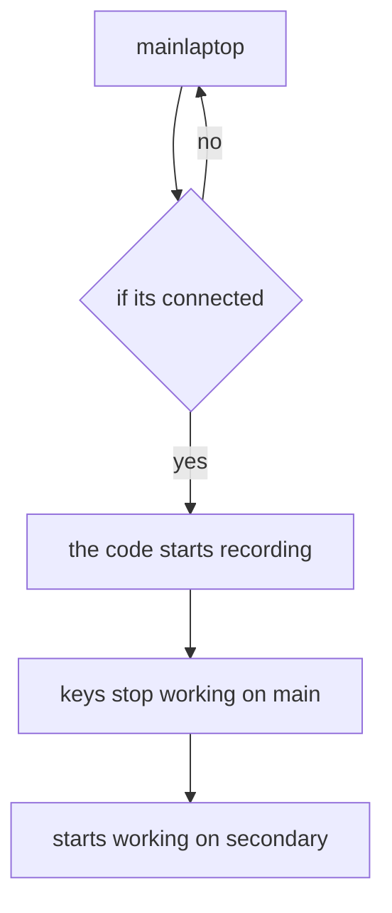

```mermaid
flowchart TD
    mainlaptop --> connection{"if its connected"} 
    connection --yes--> record["the code starts recording "]-->main["keys stop working on main"]
    main --> secondary["starts working on secondary"]
    connection -- no --> mainlaptop
```